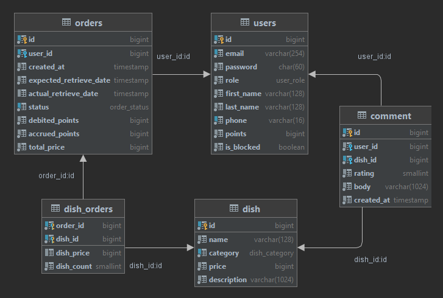

# Cafe

## Description

The **Client** places an order (chooses from the menu) and indicates the time when he would like to receive the order.  
The system displays the price of the order and offers to pay part / all the order with loyalty points. The rest of the
payment is made in cash upon receipt of the order. The **Client** can cancel the order within 5 minutes. Loyalty points
are awarded to the **Client** for completed orders. If the **Client** places an order and doesn't pick it up, then
loyalty points are deducted. If the **Client** does not take 3 or more orders, he will be blocked automatically.  
The **Client** can also rate the dishes and leave reviews.  
**Not authorized user** and **Blocked users** can only view menu, dishes and comments.  
The **Administrator** manages the menu and orders, sets/removes blocks/points for **Client**, views statistics.

## User rights

| Action                                     | Guest | Blocked user | Client | Admin |
|                   :---                     | :---: |    :---:     | :---:  | :---: |
| Sign In                                    |   ✔   |              |        |       |
| Sign Up                                    |   ✔   |              |        |       |
| Sign Out                                   |       |      ✔       |   ✔   |   ✔   |
| Change language                            |   ✔   |      ✔      |   ✔    |   ✔   |
| View menu                                  |   ✔   |      ✔      |   ✔    |   ✔   |
| Search in the menu                         |   ✔   |      ✔      |   ✔    |   ✔   |
| Add/remove dish to/from cart               |   ✔   |      ✔      |   ✔    |   ✔   |
| View dish page                             |   ✔   |      ✔      |   ✔    |   ✔   |
| Create comments                            |       |              |   ✔    |   ✔   |
| Create orders                              |       |              |   ✔    |   ✔   |
| View and edit personal profile             |       |              |   ✔    |   ✔   |
| View and delete personal orders            |       |              |   ✔    |   ✔   |
| View cafe statistics                       |       |              |        |   ✔   |
| View all orders and change their status    |       |              |        |   ✔   |
| View all dishes and edit them              |       |              |        |   ✔   |
| Create new dishes                          |       |              |        |   ✔   |
| View all users                             |       |              |        |   ✔   |
| Edit users role, points and blocked status |       |              |        |   ✔   |

## Order states

1. **PENDING**  
   This state means that order was created and is currently waiting for retrieving. During this state, points for paying
   for the order are debited from the user.
2. **COMPLETED**  
   This state means that order was completed successfully. The user has been awarded points for the order.
3. **NOT_COLLECTED**  
   This state means that the user had created an order but didn't pick it up. Debited points aren't refundable and user
   may be blocked.
4. **CANCELED**  
   This state means that the cafe cannot fulfill the order and the debited points are returned.

## Database schema

